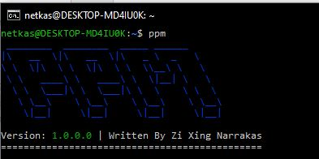

# PPM (PHP Package Manager)

PPM (PHP Package Manager) is a package manager built in PHP that allows
you to convert your PHP libraries and programs to redistributable 
files and install multiple versions of the same code onto the system
instead of locally unlike composer.

## Installing PPM

Installing PPM and installing PPM packages requires root privileges.
installed packages cannot be modified by non-root users, and the
proper permissions will be set for cache management and package lock.

Make sure the following dependencies are installed on the system

 - php (7.2+)
 - php-pear
 - php-curl
 - php-mbstring
 - php-tokenizer
 - php-fileinfo
 - git

once that all the dependencies have been met, you can apply executable
permissions to the [install](../install) script and running it as sudo

```shell script
chmod +x install
./install
```


## Verify your install

You can verify if your install was successful by running `ppm` in
your terminal, you should see an output like this




## Uninstalling ppm

To uninstall PPM from your system, you need to manually delete the
files that PPM has installed on your system.

| Path         | Description                                                                    |
|--------------|--------------------------------------------------------------------------------|
| /etc/ppm     | The main data folder housing all the packages, configurations, cache and so on |
| /var/ppm     | PPM Install, where all the core-ppm files are stored at and ppm itself         |
| /usr/bin/ppm | Symbolic link for the PPM execution point housed in /var/ppm                   |


## Clearing corrupted package lock

If your package lock is corrupted and installing packages is no longer
a possibility, the only way to fix this issue is by deleting all the
installed packages and deleting the package lock itself.

| Path              | Description                                            |
|-------------------|--------------------------------------------------------|
| /etc/ppm/packages | The directory where all package installs are housed in |
| /etc/ppm/ppm.lock | PPM Package lock file                                  |